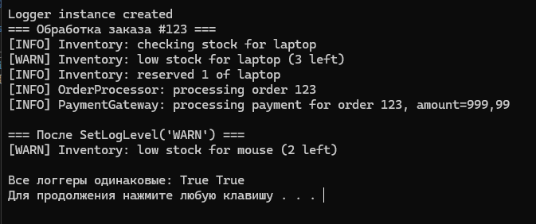

# SPI_Singleton
Реализация Singleton Logger для интернет-магазина

## Ссылка на ТЗ
[Техническое задание](ЗаданиеС.docx)

## Скриншот вывода консоли

## Описание реализации Singleton

### Ключевые элементы реализации:
1. **Приватный конструктор** - предотвращает создание экземпляров извне класса
2. **Статическое поле `instance`** - хранит ссылку на единственный экземпляр
3. **Публичный статический метод `GetInstance()`** - контролирует создание и доступ к экземпляру
4. **Ленивая инициализация** - экземпляр создаётся только при первом обращении

### Особенности реализации:
- Простая реализация без многопоточности
- Централизованное управление уровнем логирования через `SetLogLevel()`
- Все модули используют один экземпляр логгера (проверяется через `ReferenceEquals`)
- Фильтрация сообщений по уровням (INFO < WARN < ERROR)

### Использование в классах:
- `InventoryManager`, `OrderProcessor`, `PaymentGateway` получают логгер через `Logger.GetInstance()`
- Изменение уровня логирования влияет на все модули одновременно
- Формат вывода: `[LEVEL] message`